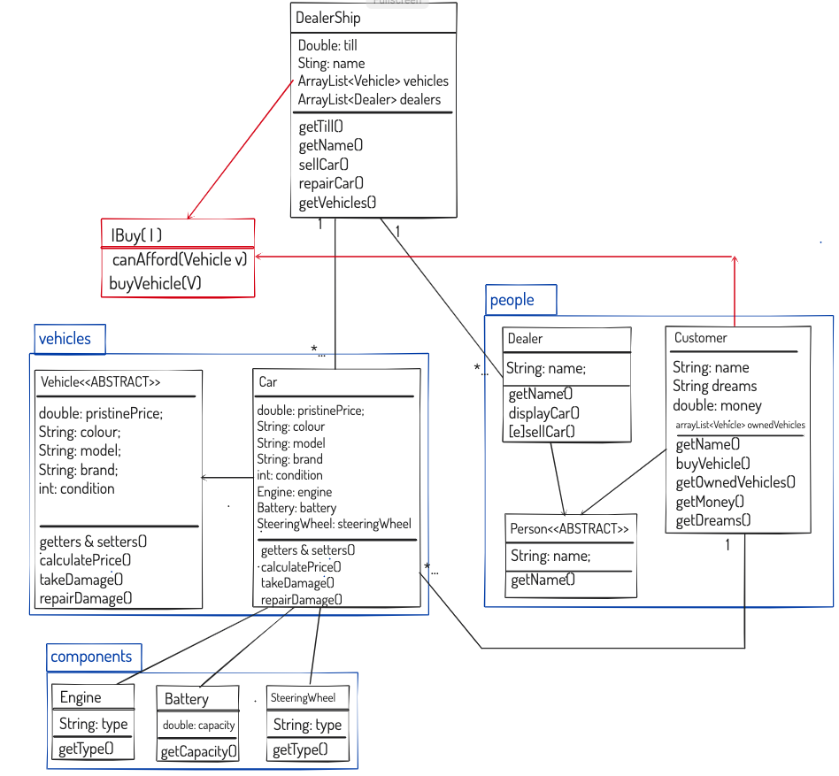

#  TASK
#### Model a car dealership, making sure to use
- [x] polymorphism
- [x] interfaces
- [x] abstraction.

##### Work in TDD fashion, creating tests for classes. Plan effectively in preparation for the extensions.

### MVP
- [x] Create classes for different components (e.g. engine, tyres) that can be used to compose a vehicle
- [x] Create different vehicle types (e.g. Car, Electric Car, Hybrid Car, etc)
- [x] Assign them various properties (e.g. price, colour, engine etc.)
- [x] Create classes for Customer and Dealership.
- [x] Customers will have money, and a collection of owned vehicles.
- [x] Dealership will have stock of different types of cars and a till.
#### Extension
- [x] Allow a customer to buy a vehicle.
- [x] Allow dealership to buy vehicles
- [x] Allow Dealerships to sell vehicles to customers.
- [ ] Allow damage to be added to a vehicle. This should be a cost and be removed from vehicles price.
- [x] Allow dealership to repair vehicles. This should take the cost from the dealer and add back to value of vehicle.

### Planning:
